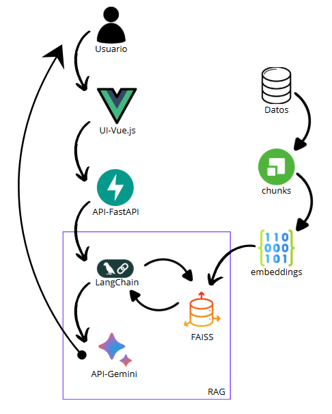

#### 💪 API para implementación de MuscleAI – Asistente IA en Anatomía Muscular

Un sistema inteligente de preguntas y respuestas diseñado para estudiantes de fisioterapia. Utiliza **RAG** (Retrieval-Augmented Generation) para ofrecer información detallada y precisa sobre músculos, inserciones, funciones y relaciones anatómicas.

---



---

## 🌟 Características principales

- **Tecnología RAG**: Recuperación semántica combinada con generación de texto contextual.
- **Modelo Gemini 2.0 Flash**: IA de Google optimizada para español y consultas educativas.
- **Procesamiento de documentos anatómicos**: Soporte para archivos PDF y TXT con contenido médico.
- **API RESTful**: Fácil integración con interfaces web, móviles o educativas.
- **Sistema con fuentes trazables**: Referencias anatómicas utilizadas en cada respuesta.

---

## 🛠️ Requisitos técnicos

- Python 3.10+ (Actual: `Python 3.13.3`)
- Node.js 18+ (Actual: `v22.15.1`)
- Vue CLI (Actual: `@vue/cli 5.0.8`)
- Cuenta en Google Cloud con API Key para Gemini AI
- Espacio en disco para almacenar los documentos anatómicos

---

## 🚀 Instalación

### 1. Clonar el repositorio

```bash
git clone https://github.com/Julianj09/chat-muscle-api-v1.git
cd chat-muscle-api-v1
```

### 2. Configurar entorno virtual (Python)

```bash
python -m venv venv
venv\Scripts\activate
```

### 3. Instalar dependencias de Python

```bash
pip install -r requirements.txt
```

### 4. Configurar variables de entorno

Crear un archivo `.env` en la raíz del proyecto con el siguiente contenido:

```env
GOOGLE_API_KEY=tu_api_key_de_google
```

### 5. Preparar documentos anatómicos

Colocar los archivos PDF y TXT con contenido anatómico en:

```
app/rag/data/
```

---

## 🏃 Ejecución del proyecto

Iniciar el servidor FastAPI:

```bash
uvicorn app.main:app --reload
```

La API estará disponible en:

- Interfaz Swagger: [http://127.0.0.1:8000/docs](http://127.0.0.1:8000/docs)  
- Endpoint principal: [http://127.0.0.1:8000](http://127.0.0.1:8000)

---

## 📝 Uso de la API

### Realizar una consulta

**POST** `/ask`

```json
{
  "query": "¿Cuál es la función del músculo psoas mayor?"
}
```

### Respuesta de ejemplo

```json
{
  "response": "El músculo psoas mayor actúa como flexor principal de la cadera...",
  "sources": [
    {
      "extracto": "El psoas mayor se origina en la columna lumbar y se inserta en el fémur...",
      "pagina": 12,
      "archivo": "musculos_basicos.pdf"
    }
  ]
}
```

---

## 🧰 Estructura del proyecto

```
chat-muscle-api-v1/
├── app/
│   ├── rag/
│   │   ├── chain.py          # Pipeline RAG (LangChain + Gemini)
│   │   ├── loader.py         # Carga de documentos PDF/TXT
│   │   ├── splitter.py       # División de texto en chunks
│   │   ├── vectorstore.py    # Generación y almacenamiento de embeddings FAISS
│   │   └── data/             # Documentos anatómicos
│   └── main.py               # Aplicación FastAPI
├── requirements.txt          # Dependencias del proyecto
└── .env                      # Variables de entorno (API Key, configuración)
```